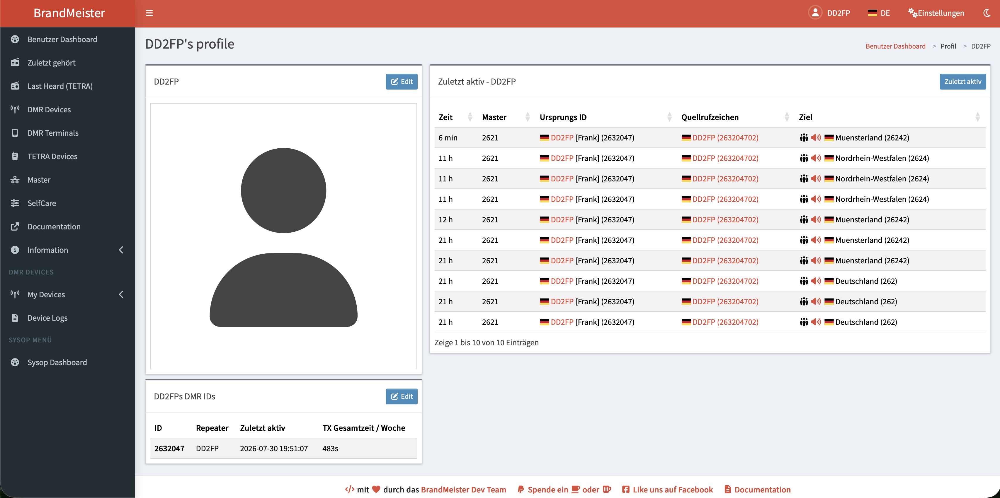

# BrandMeister → QRZ.COM

Ein Safari-Userscript, das Klicks auf Rufzeichen im BrandMeister-Dashboard
direkt auf das zugehörige QRZ.COM-Profil umleitet.

## Hintergrund
Im Amateurfunk erfreut sich die digitale Betriebsart DMR, insbesondere das BrandMaster-Netzwerk, einer hohen Beliebtheit. Hier steht das sehr komfortable BrandMeister-Dashboard [https://brandmeister.network](https://brandmeister.network) zur Verfügung, das es mittels entsprechender Filter erlaubt, bestimmte Talkgroups (z.B. 91, 262) zu selektieren und die zuletzt aktiven OM anzuzeigen. Die entsprechenden Calls der OM werden angezeigt und der Server stellt auch einen Link zur Verfügung. Allerdings tragen die wenigsten OM eine Informationen in diesem Link ein, sodass der Link sehr oft eine leere Seite ohne Inhalte anzeigt. Hier ein typisches Beispiel einer solchen Seite:

Andererseits hinterlegen sehr viele OM Informationen zu ihrer Technik, Interessen und Ausstattung in [QRZ.COM](https://qrz.com). Es wäre daher praktisch, wenn ein Klick im BrandMeister-Dashboard auf die Seite des OM in [QRZ.COM](https://qrz.com) umleiten würde. 

Die ist mit der App [Userscripts](https://apps.apple.com/app/userscripts/id1463298887) möglich, die den Link des Call vom BrandMeister-Dashboard auf [QRZ.COM](https://qrz.com) umleitet. Das vorliegende Skript stellt mit Hife der App Userscripts eine entsprechende Lösung zur Verfügung.

## Installation

1. [Userscripts](https://apps.apple.com/app/userscripts/id1463298887) für Safari installieren
2. In der App unter *Settings → Directory* ein lokales Verzeichnis wählen
3. `brandmeister-qrz.user.js` in dieses Verzeichnis legen
4. In Safari unter *Settings → Extensions → Userscripts* die Berechtigung für
   `brandmeister.network` auf **Allow** setzen (nicht „Allow for One Day")

## Funktionsweise

Das Script erkennt Rufzeichen in drei Stufen:

1. Hash-Route im Link (`#/profile/DO2BX`) — der aktuelle Weg
2. Query-Parameter `?call=` — Altbestand
3. Linktext gegen ein Rufzeichen-Muster — Rückfallebene

## Bekannte Stolpersteine

- **CSP:** brandmeister.network blockiert Injektion im Seitenkontext, daher
  `@inject-into content` im Metadatenblock.
- **iCloud:** Liegt das Script-Verzeichnis in iCloud Drive, kann macOS die
  Datei auslagern, sodass die Erweiterung sie nicht mehr lesen kann.
- **Konsolenausgaben** des Scripts erscheinen nur im Erweiterungs-Kontext;
  unten rechts in der Safari-Konsole den Kontext umschalten.

## Plattform: macOS/Safari getestet, Windows/Linux ungetestet

Der hier beschriebene Workflow — Safari, macOS, die App Userscripts — ist der
einzige, den der Autor selbst getestet hat. Für Windows oder Linux gibt es
keine gleichwertige Anleitung, weil dem Autor dafür keine Testumgebung zur
Verfügung steht.

Prinzipiell sollte sich die Umleitung auch dort umsetzen lassen, da
`brandmeister-qrz.user.js` reines Vanilla-JavaScript ohne macOS- oder
Safari-spezifische APIs ist. Der naheliegende Weg wäre eine
Userscript-Erweiterung für den jeweiligen Browser, z. B.:

- **Windows/Linux mit Chrome, Edge oder Firefox:** [Tampermonkey](https://www.tampermonkey.net/)
  oder [Violentmonkey](https://violentmonkey.github.io/) installieren und
  `brandmeister-qrz.user.js` dort als neues Userscript einfügen.

Ein Punkt, der dabei vermutlich angepasst werden müsste: `@inject-into content`
ist eine Eigenheit der Safari-App Userscripts (quoid), mit der sie zwischen
Seiten- und Erweiterungs-Kontext unterscheidet. Tampermonkey/Violentmonkey
kennen dieses Metadaten-Feld nicht und regeln die Ausführungsumgebung über
eigene Mechanismen (u. a. `@grant`/Sandbox-Einstellungen). Da
brandmeister.network eine CSP durchsetzt, die Injektion im Seitenkontext
blockiert (siehe „Bekannte Stolpersteine"), müsste im Zweifel genau geprüft
werden, ob das Script dort automatisch im richtigen Kontext läuft oder ob eine
zusätzliche Einstellung nötig ist.

Da der Autor das nicht selbst nachvollziehen kann, ist dieser Abschnitt
Spekulation auf Basis der Dokumentation der jeweiligen Erweiterungen —
Rückmeldungen oder Pull Requests von Windows-/Linux-Nutzern sind willkommen.

## Lizenz

MIT
